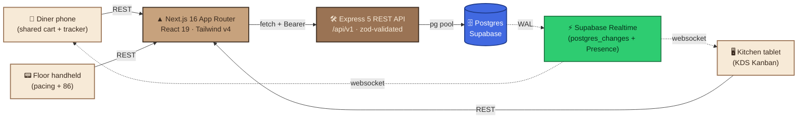
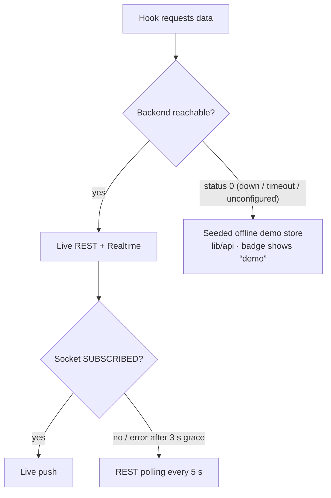
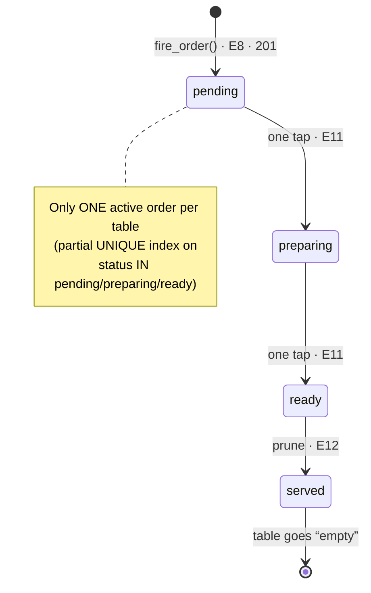
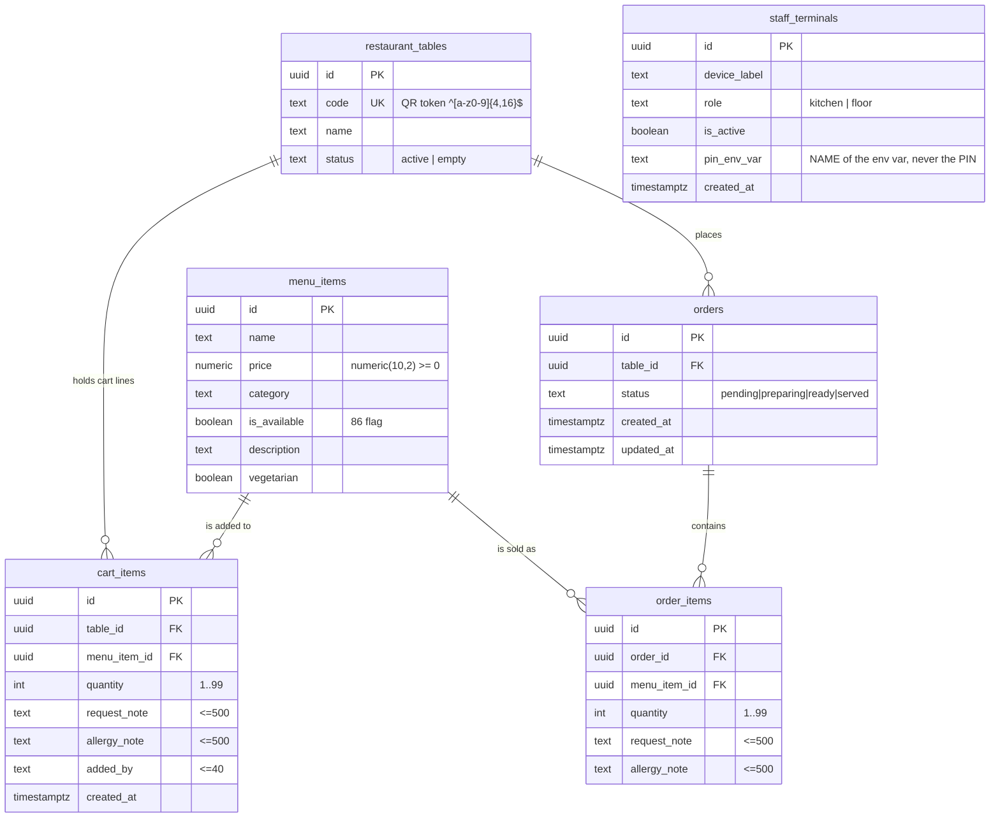
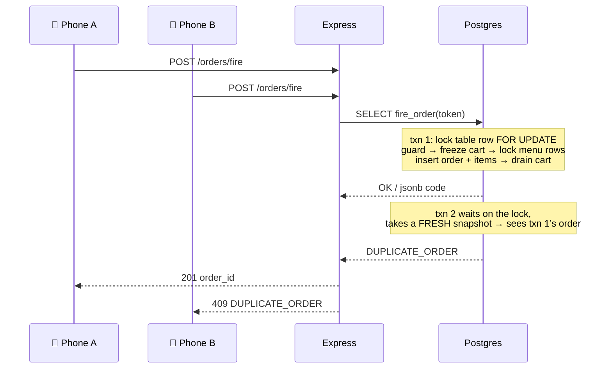
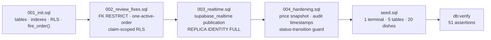

<div align="center">

# 🍛 AeyChhotu!

### One table, one order, live from the kitchen.

A zero-download, real-time operational bridge that **groups every phone at a table into one
shared cart**, fires **one clean ticket** to the kitchen, and streams two-way status updates
back to the diner — no app install, no login for guests.

[](#-tech-stack)
[](#-tech-stack)
[](#-tech-stack)
[](#-tech-stack)
[](#-tech-stack)
[](#-tech-stack)
[](#-tech-stack)

**Status:** MVP feature-complete and verified against a live Supabase database — **51/51** schema, RLS &
hardening assertions, **69/69** contract checks, both apps green on typecheck · lint · build. CI enforces it
(see [Project Status](#-project-status)).

</div>

---

## 📖 Table of contents

- [Live deployment](#-live-deployment)
- [The problem](#-the-problem)
- [Core features](#-core-features)
- [Who it is for](#-who-it-is-for)
- [System architecture](#-system-architecture)
- [Order lifecycle](#-order-lifecycle)
- [Data model](#-data-model)
- [Backend architecture](#-backend-architecture)
- [Frontend architecture](#-frontend-architecture)
- [Realtime channels](#-realtime-channels)
- [Tech stack](#-tech-stack)
- [Repository layout](#-repository-layout)
- [Quick start](#-quick-start)
- [Environment variables](#-environment-variables)
- [Database setup](#-database-setup)
- [API reference](#-api-reference)
- [Security model](#-security-model)
- [Build & verification](#-build-verification)
- [Project status](#-project-status)
- [Documentation index](#-documentation-index)

---

## 🌍 Live deployment

The free path is **deployed and verified** — Vercel + Render + Supabase, no code changes required.

| Surface | URL | Credential |
|---|---|---|
| Diner menu · live shared cart | <https://aeychhotu.vercel.app/table/k7x2p> | none |
| Order tracker | <https://aeychhotu.vercel.app/table/k7x2p/tracker> | none |
| Kitchen board (KDS) | <https://aeychhotu.vercel.app/kitchen> | `STAFF_PIN` |
| Floor view | <https://aeychhotu.vercel.app/floor> | `STAFF_PIN` |
| REST API | <https://aeychhotu-api-bkp8.onrender.com> | — |

> ⏰ **The free API sleeps — plan around it for a demo.** Render spins a Free web service down after
> **15 minutes** with no inbound traffic (HTTP requests *or* WebSocket messages), and waking it takes
> **~1 minute**. Both apps handle it: the client surfaces *"Serving line taking a moment to spin up,
> please try again!"*, and the production demo-fallback gate means it will **not** quietly serve seeded
> dishes instead.

### ⏰ Keeping the API awake for a demo

Run this **once** — it holds the API awake for **3 hours**, then stops by itself, so you spend instance
hours only for the window you asked for:

```bash
cd backend && npm run keep-alive -- https://aeychhotu-api-bkp8.onrender.com
```

To keep it running after you close the terminal:

```bash
cd backend && nohup npm run keep-alive -- https://aeychhotu-api-bkp8.onrender.com > /tmp/aeychhotu-keepalive.log 2>&1 &
```

Tune the window with `KEEP_ALIVE_HOURS` (default `3`) and `KEEP_ALIVE_INTERVAL_MIN` (default `10`).
Leaving the **`/floor`** screen open also works — it polls every 15 s unconditionally. `/kitchen` and the
diner screens do **not**: with Realtime healthy their updates arrive over Supabase WebSockets, which
never touch Render.

> Budget note: Render grants **750 Free instance hours per workspace per month**, and one always-on
> service costs up to 744 h — so a 24/7 pinger leaves no margin and fits **only if that is the only Free
> web service you run.** Full detail in [`docs/11-deploy.md`](docs/11-deploy.md) §4.

---

## 😖 The problem

Traditional QR-ordering tools stop manual typing errors but create three new ones:

| # | Failure mode | What happens in a real rush |
|---|---|---|
| 1 | **Ticket fragmentation** | 8 people at one table each tap “Submit” → the kitchen gets **8 separate tickets**, courses arrive out of order. |
| 2 | **Buried allergy notes** | Serious allergy text hides in the same tiny box as “extra sauce”. Kitchens miss it. |
| 3 | **One-way kitchen screens** | The cook taps *Done* → nothing reaches the diner or the server. Everyone waits blind, food dies under the lamp. |

**AeyChhotu! attacks all three:** a shared table cart that fires once, allergy notes rendered
unavoidably on the KDS, and a live `pending → preparing → ready → served` state stream to the diner’s browser.

---

## ✨ Core features

| # | Feature | Where it lives | Status |
|---|---|---|---|
| 1 | Anonymous table initialization (QR `…/table/k7x2p`) | `E1` + `app/table/[token]` | ✅ |
| 2 | KDS shift authentication (shared `STAFF_PIN`) | `E2` / `E2b` + `kitchen-pin-wall` | ✅ |
| 3 | Live menu browsing (86’d items greyed, never hidden) | `E3` + `menu-list` | ✅ |
| 4 | Real-time **shared table cart** (upsert + atomic delta edits) | `E4`–`E6` + channel A | ✅ |
| 5 | Cart line removal | `E7` | ✅ |
| 6 | **“Review & Fire”** — atomic order submission | `E8` → `fire_order()` RPC | ✅ |
| 7 | Anti-duplicate guardrail (“Order already sent”) | `E9` + DB partial unique index | ✅ |
| 8 | Kitchen Kanban dashboard (Pending / Preparing / Ready) | `E10` + channel B | ✅ |
| 9 | Guardrailed allergy rendering (bold red on the card) | inside `E10` payload | ✅ |
| 10 | One-tap status state machine | `E11` | ✅ |
| 11 | Completed ticket pruning → table goes `empty` | `E12` | ✅ |
| 12 | Live guest progress tracker (grey → amber → **green flash**) | `E15` / `E16` + channel C | ✅ |
| 13 | Screen flash & audio chime (“Start shift”) | `E13` + `lib/sound.ts` | ✅ |
| 14 | Quick item hide / 86ing | `E14` | ✅ |
| 15 | Floor view pacing board (S6) | `E17` + `floor-view` | ✅ live, PIN-gated |

---

## 🧑‍🍳 Who it is for

<div align="center">

| 👤 The Diner | 🍳 The Line Chef (Mr. Baawarchi) | 🏃 The Server (Chhotu) |
|---|---|---|
| Scans QR, edits the shared cart, types allergy notes, taps **Review & Fire** | Watches the Kanban, reads bold-red allergy alerts, one-tap status tags | Monitors floor pacing, runs food, 86’s dishes in one tap |
| `/table/[token]` · `/table/[token]/tracker` | `/kitchen` | `/floor` |

</div>

---

## 🏗 System architecture



**Three guarantees the architecture makes:**

1. **No business rule lives only in the browser.** Fire, duplicate-guard, inventory check and cart drain happen in *one* Postgres transaction (`fire_order()`).
2. **Realtime is an optimization, never a requirement.** Every subscription has a REST path underneath; a dead socket degrades to polite 5 s polling.
3. **`service_role` never leaves the server.** Browsers hold only the public `anon` key plus a **read-scoped** `realtime_token` whose claims the RLS policies match on.

### Verification scripts

Every claim above is a command anyone can re-run:

| Command | Where | What it proves |
|---|---|---|
| `npm run db:setup` | `backend/` | applies all SQL (idempotent) |
| `npm test` | both apps | isolated unit tests: schemas, JWT, state machine (47) · normalizers, fallback gate (10) |
| `npm run db:verify` | `backend/` | 51 assertions: schema, RLS on, 24 policies, indexes, claim-scoping, privileges, hardening |
| `npm run smoke` | `backend/` | 69 contract checks across diner → kitchen → floor |
| `npm run realtime:check` | `frontend/` | Realtime auth, delivery, RLS scoping, Presence |
| `npm run check:floor` | `frontend/` | the floor UI in real headless Chrome |

The three live suites need both servers running (`npm run dev` in each app).

### The data-source ladder (diner + KDS)



---

## 🔄 Order lifecycle



**Key rule:** a `served` order **falls out** of the partial unique index, so a closed round
never blocks the table’s next fire — the “cancelled booking must not block re-booking” requirement.

---

## 🗄 Data model



**Delete behaviour:** `cart_items → restaurant_tables` is `CASCADE`; `orders → restaurant_tables`
is `RESTRICT` (history can never be wiped by a table delete); every `→ menu_items` link is `RESTRICT`.

**Indexes** (7 + 1 partial unique): `cart_items_upsert_uq`, `cart_items_table_created_idx`,
`orders_table_status_idx`, `orders_active_idx` (partial), `orders_created_idx`,
`order_items_order_idx`, `menu_items_category_idx`, `orders_one_active_uq` (partial unique).
The DB review in [`docs/10-db-report.md`](docs/10-db-report.md) confirms **zero additional indexes are needed** — every access path is already covered.

---

## 🛠 Backend architecture

```
Request
  → cors(CLIENT_URL only) → express.json(1mb)
  → Router (zod parseOrThrow → service)          E1–E17
  → notFoundHandler → errorHandler  ⟶ { success:false, error:{ code, message, … } }
```

| Layer | Files | Responsibility |
|---|---|---|
| **Config** | `src/config/env.ts` | Validates env at boot; missing/invalid → loud `exit(1)` |
| **DB** | `src/db/pool.ts` | Single shared `pg` Pool (max 10), fatal on idle-client error |
| **Routes** | `src/routes/*.ts` | Thin HTTP → service mapping, contract envelope |
| **Validators** | `src/validation/schemas.ts` | One zod schema per endpoint; failures → `400 VALIDATION_ERROR` with `error.fields` |
| **Services** | `src/services/*.ts` | All business logic + SQL; ownership checks; `AppError`s |
| **Auth** | `src/lib/jwt.ts`, `src/middleware/auth.ts` | Dependency-free HS256 sign/verify, `requireAuth` (401) + `requireRole` (403) |
| **Errors** | `src/errors/app-error.ts`, `middleware/error-handler.ts` | One envelope, no stack traces leaked |

### The atomic fire (E8)



Business outcomes are **returned as `jsonb` codes rather than raised**, so an
`INVENTORY_FAILURE` cart purge still commits — the cart the diner sees always matches the 409 they are told.

---

## 🎨 Frontend architecture

| Layer | Path | Notes |
|---|---|---|
| App Router pages | `app/` | 6 routes: `/`, `/floor`, `/kitchen`, `/table/[token]`, `/table/[token]/tracker`, `api/v1/auth/kds-login` |
| UI primitives | `components/ui/` | 24 reusable components (Button, Card, Modal, Drawer, Toast, Field, EmptyState, …) |
| Diner surfaces | `components/diner/` | menu list, cart modal/strip, allergy input, live tracker |
| Staff surfaces | `components/staff/` | PIN wall, KDS board + cards, floor view, 86 drawer |
| Data runtimes | `hooks/use-live-table.ts`, `hooks/use-live-kds.ts` | Live-first with mock fallback + realtime + polling safety net |
| API client | `lib/api-client/` | `apiClient` (20 s timeout, envelope parse, 401 guard), `endpoints` (1 fn per endpoint), `realtime`, `paginate`, `normalize` |
| Offline demo store | `lib/api/` | Seeded store used **only** when the backend is unreachable |
| Design tokens | `app/globals.css` | `@theme` block (Hospitality skin) + an unlayered `[data-skin="ops"]` block (dark kitchen/floor console) — palette, type scale, radii, shadows, motion timings |

**Motion:** entrance reveals (`components/motion/reveal.tsx`), status/overlay/card transitions,
transform/opacity-only animations, and `useReducedMotion` respected everywhere.

**Skins:** diner and marketing surfaces use the light Hospitality skin; `/kitchen` and `/floor` opt into
`data-skin="ops"` for the high-contrast dark console read at ticket distance.

---

## ⚡ Realtime channels

| # | Channel | Transport | Payload | Consumers |
|---|---|---|---|---|
| **A** | `table_carts:{table_token}` | `postgres_changes` on `cart_items` | INSERT / UPDATE / DELETE | S1 menu, S2 cart |
| **B** | `kds_orders` | `postgres_changes` on `orders` | INSERT → chime + refetch | S5 board |
| **C** | `order_tracker:{order_id}` | `postgres_changes` on `orders` | UPDATE → colour / green flash | S1, S3 tracker |
| **D** | `table_presence:{table_token}` | Supabase **Presence** | `{ device_id, table_token }` | S1 active-diners badge |

> Realtime needs **all three**: `NEXT_PUBLIC_SUPABASE_URL`, `NEXT_PUBLIC_SUPABASE_ANON_KEY`
> (frontend) **and** `SUPABASE_JWT_SECRET` (backend, used to mint the RLS-scoped `realtime_token`).
> Without them the app silently — and safely — runs REST + polling.

---

## 🧰 Tech stack

<table>
<tr><th>Layer</th><th>Technology</th></tr>
<tr><td><b>Frontend</b></td><td>Next.js 16.3.6 (App Router, Turbopack) · React 19.3 · TypeScript 6 strict · Tailwind CSS v4 · <code>motion</code> v13 · lucide-react · Fraunces + Inter via <code>next/font</code></td></tr>
<tr><td><b>Backend</b></td><td>Node ≥ 20 · Express 5.2.1 · <code>pg</code> 8.23 · zod 4.6.5 · TypeScript 6 (<code>tsx</code> dev, <code>tsc</code> build) · zero-dependency HS256 JWT</td></tr>
<tr><td><b>Data</b></td><td>Postgres (Supabase) · SQL migrations · RLS · plpgsql <code>fire_order()</code> RPC</td></tr>
<tr><td><b>Realtime</b></td><td>Supabase Realtime (<code>postgres_changes</code> + Presence) — optional, with REST polling fallback</td></tr>
</table>

**No UI kits, no ORM, no auth provider** — the surface is deliberately small and dependency-light.

---

## 📁 Repository layout

```
.
├── README.md                  ← you are here
├── .gitignore                 ← repo-wide: secrets, logs, build output, noise
├── render.yaml                ← free hosting Blueprint for the API (docs/11-deploy.md)
├── .github/workflows/ci.yml   ← typecheck · lint · build + schema/contract suites
├── backend/                   ← Express REST API (owns all writes)
│   ├── sql/
│   │   ├── 001_init.sql       ← tables, indexes, RLS, fire_order() RPC
│   │   ├── 002_review_fixes.sql ← FK RESTRICT, one-active-order index, scoped RLS
│   │   ├── 003_realtime.sql   ← Realtime publication + REPLICA IDENTITY FULL
│   │   └── seed.sql           ← idempotent: 1 terminal / 5 tables / 20 dishes
│   ├── scripts/
│   │   ├── db-setup.mjs       ← npm run db:setup   (apply every sql/*.sql)
│   │   ├── db-verify.mjs      ← npm run db:verify  (51 schema/RLS/hardening assertions)
│   │   └── smoke.mjs          ← npm run smoke      (69 contract checks)
│   ├── src/
│   │   ├── config/env.ts      ← boot-time env validation (exit 1 if broken)
│   │   ├── db/pool.ts         ← shared pg Pool
│   │   ├── lib/               ← jwt.ts · util.ts
│   │   ├── middleware/        ← auth · not-found · error-handler
│   │   ├── routes/            ← sessions auth menu cart orders kds floor health
│   │   ├── services/          ← all business logic + SQL
│   │   ├── validation/        ← zod schemas (one per endpoint)
│   │   └── main: index.ts · app.ts
│   ├── .env.example
│   └── package.json
├── frontend/                  ← Next.js 16 app
│   ├── app/                   ← routes, layout, globals.css, error/not-found
│   ├── components/            ← ui/ · diner/ · staff/ · motion/ · layout/ · brand/
│   ├── hooks/                 ← use-live-table · use-live-kds · use-db · use-presence · use-now
│   ├── lib/
│   │   ├── api-client/        ← apiClient · endpoints · realtime · paginate · normalize · types
│   │   └── api/               ← offline demo store (fallback only)
│   ├── .env.example
│   └── package.json
└── docs/                      ← 11 design + engineering documents (source of truth)
```

---

## 🚀 Quick start

### Prerequisites

- **Node.js ≥ 20** (backend declares `engines.node >= 20`)
- **A Postgres database** — Supabase project (recommended) or local Postgres 15+
- `psql` on your PATH

### 1 · Install

```bash
cd backend  && npm install
cd ../frontend && npm install
```

### 2 · Create the schema, wire Realtime and seed

```bash
cd backend
npm run db:setup          # applies every sql/*.sql in order
npm run db:verify         # asserts the result (see below)
```

No `psql` needed — the runner uses the `pg` dependency you already have. Every step is **idempotent**, so re-running is always safe: 1 terminal, 5 tables, 20 dishes, no duplicates.

```bash
npm run db:setup -- --dry-run     # list what would be applied
npm run db:setup -- --no-seed     # schema only
npm run db:verify                 # 51 assertions: schema, RLS scope, indexes, privileges, hardening
```

> 🌱 **`db:setup` also wires Supabase Realtime** (`003_realtime.sql`). That step used to be a dashboard click that failed *silently* when skipped — the browser subscribes fine, receives zero events, and the app quietly falls back to REST polling. On a Postgres without `wal_level=logical` it now reports that instead of aborting.

### 3 · Configure environment

```bash
cp backend/.env.example  backend/.env
cp frontend/.env.example frontend/.env.local
# edit both files — see the reference below
```

### 4 · Run

```bash
# terminal 1
cd backend  && npm run dev        # → http://localhost:4000

# terminal 2
cd frontend && npm run dev        # → http://localhost:3000
```

### 5 · Open the surfaces

| Surface | URL | Credential |
|---|---|---|
| Diner menu (seeded QR token) | <http://localhost:3000/table/k7x2p> | none |
| Live order tracker | <http://localhost:3000/table/k7x2p/tracker> | none |
| Kitchen board | <http://localhost:3000/kitchen> | `STAFF_PIN` (example `1234`) |
| Floor view | <http://localhost:3000/floor> | `STAFF_PIN` |
| API liveness | <http://localhost:4000/api/v1/health> | none |

**Going live:** the free path (Next.js on Vercel · API on Render · Postgres on Supabase) is **already
deployed** — see [Live deployment](#-live-deployment). [`docs/11-deploy.md`](docs/11-deploy.md) is the
step-by-step record, including the CORS round-trip, the sleep/cold-start caveat and the verification
commands. Both apps are push-to-deploy on `main`.

---

## 🔐 Environment variables

### `backend/.env`

| Variable | Required | Example | Purpose |
|---|---|---|---|
| `PORT` | no | `4000` | API listen port |
| `NODE_ENV` | no | `development` | `production` adds the `Secure` flag to the KDS cookie |
| `CLIENT_URL` | **yes** | `http://localhost:3000` | CORS allow-list — one origin, or several **comma-separated** (prod domain + Vercel preview URLs). No trailing slash |
| `DATABASE_URL` | **yes** | `postgresql://…` | Postgres/Supabase connection string — server refuses to boot without it |
| `STAFF_PIN` | **yes** | `1234` | 4–6 digit kitchen PIN; validated at boot |
| `KDS_TOKEN_SECRET` | **yes** | long random string | HMAC secret for shift JWTs |
| `SUPABASE_JWT_SECRET` | no | from Supabase → Settings → API | When set, E1/E2 also mint the RLS-scoped `realtime_token`. Empty ⇒ REST-only, by design |
| `COOKIE_SAME_SITE` | no | `strict` | `strict` \| `lax` \| `none` for the httpOnly `kds_token` cookie. Use `none` when frontend and API live on **different sites** — it forces `Secure` automatically |

### `frontend/.env.local`

| Variable | Required | Example | Purpose |
|---|---|---|---|
| `NEXT_PUBLIC_API_URL` | **yes** | `http://localhost:4000` | Express base URL, no trailing slash |
| `NEXT_PUBLIC_SUPABASE_URL` | for Realtime | `https://xxx.supabase.co` | Realtime endpoint |
| `NEXT_PUBLIC_SUPABASE_ANON_KEY` | for Realtime | `eyJ…` | **Public anon key only** — never `service_role` |
| `NEXT_PUBLIC_ENABLE_DEMO_FALLBACK` | no | *(empty)* | Opts back into the offline demo store. **Default: on in `next dev`, off in a production build** — a deployment with a wrong API URL must fail loudly, not render seeded dishes as real orders |
| `STAFF_PIN` | no | `1234` | Used only by the dev-only offline route `app/api/v1/auth/kds-login`, which returns `404` in a production build |

> ⚠️ Never commit `.env` / `.env.local`. Both are gitignored; only the `.env.example` templates are tracked.

---

## 🗃 Database setup



Run the whole chain with **`npm run db:setup`** — no `psql`, no dashboard clicks, safe to re-run.
`003_realtime.sql` needs `wal_level=logical` (Supabase default). On a plain Postgres it reports the
limitation and skips, and the app correctly degrades to REST + polling instead of failing to set up.

`fire_order(p_table_token text) RETURNS jsonb` is the heart of the system: it locks the table row
(`FOR UPDATE`), guards duplicates, freezes and checks the cart, locks the referenced menu rows
(`FOR UPDATE OF mi`, so 86-ing serializes against it), builds the ticket, and drains only the frozen lines.
It is **revoked from `anon`/`authenticated`** — only the backend’s service path may execute it.

---

## 📡 API reference

**Envelope (every endpoint):**

```jsonc
// success
{ "success": true, "data": { }, "meta": { "page": 1, "limit": 20, "total": 12, "total_pages": 1 } }
// error
{ "success": false, "error": { "code": "SCREAMING_SNAKE_CASE", "message": "…", "fields": { } } }
```

`meta` appears **only** on paginated list endpoints. Full contract: [`docs/7-api-contract.md`](docs/7-api-contract.md).

| # | Method & path | Auth | Screen | Paginated |
|---|---|---|---|---|
| E1 | `POST /api/v1/sessions/initialize` | none | S1 | — |
| E2 | `POST /api/v1/auth/kds-login` | none | S4 | — |
| E2b | `GET /api/v1/auth/me` | staff token (header **or** cookie) | S4/S5 | — |
| E3 | `GET /api/v1/menu` | none | S1 · S5 · S6 | ✅ |
| E4 | `GET /api/v1/cart/items` | none | S1 · S2 | ✅ |
| E5 | `POST /api/v1/cart/items` | none | S1 · S2 | — |
| E6 | `PATCH /api/v1/cart/items/:cart_item_id` | none | S2 | — |
| E7 | `DELETE /api/v1/cart/items` | none | S2 | — |
| E8 | `POST /api/v1/orders/fire` | none | S2 | — |
| E9 | `GET /api/v1/sessions/:table_token/active-check` | none | S1 · S2 · S3 | — |
| E10 | `GET /api/v1/kds/tickets` | staff | S5 | ✅ |
| E11 | `PATCH /api/v1/kds/tickets/:order_id/status` | staff | S5 | — |
| E12 | `PATCH /api/v1/kds/tickets/:order_id/prune` | staff | S5 | — |
| E13 | `POST /api/v1/kds/shift/activate` | staff | S5 | — |
| E14 | `PATCH /api/v1/menu/items/:menu_item_id/availability` | staff | S5 · S6 | — |
| E15 | `GET /api/v1/orders/:order_id/status` | none (`order_id` + `table_token`) | S3 | — |
| E16 | `GET /api/v1/orders` | none | S3 | ✅ |
| E17 | `GET /api/v1/floor/tables` | staff | S6 | ✅ |

**Error-code registry:** `VALIDATION_ERROR` `400` · `INVALID_PIN` `401` · `UNAUTHORIZED` `401`
`FORBIDDEN` `403` · `TABLE_NOT_FOUND` `404` · `MENU_ITEM_NOT_FOUND` `404` · `CART_ITEM_NOT_FOUND` `404`
`ORDER_NOT_FOUND` `404` · `ITEM_UNAVAILABLE` `409` · `EMPTY_CART` `409` · `DUPLICATE_ORDER` `409`
`INVENTORY_FAILURE` `409` · `INVALID_STATUS_TRANSITION` `409` · `INTERNAL_ERROR` `500`

---

## 🛡 Security model

| Concern | Mitigation |
|---|---|
| **No login for diners** | The random QR token (`^[a-z0-9]{4,16}$`) **is** the capability credential; it is unguessable and maps to one table |
| **Cross-table data leaks** | Three layers: `table_token` resolved server-side, every SQL write re-asserts `AND table_id = $2`, and RLS SELECT policies are claim-scoped (`table_token` claim for diners, `staff` claim for the kitchen) |
| **No token ⇒ no rows** | A browser with only the public `anon` key reads nothing — the old `USING (true)` hole is closed in `002_review_fixes.sql` |
| **Kitchen is PIN-gated** | `STAFF_PIN` compared with `timingSafeEqual`; token is an 8-hour HS256 JWT with an explicit `role: "kitchen"` claim; `requireAuth` → 401, `requireRole` → 403 |
| **Writes bypass RLS only server-side** | `service_role` and `fire_order()` never reach the browser; `anon` has **no** INSERT/UPDATE/DELETE policy |
| **Secrets never echo** | `staff_terminals.pin_env_var` stores the *variable name*; no PIN, secret or stack trace ever appears in a payload or log |
| **Boot fails loudly** | Missing/invalid env → clear message + `exit(1)`, never a half-working server |

---

## ✅ Build & verification

Everything below was run and is green on the current tree:

| Check | Command | Result |
|---|---|---|
| Backend types | `cd backend && npm run typecheck` | ✅ 0 errors |
| Backend build | `cd backend && npm run build` | ✅ clean `dist/` emit |
| **Backend unit tests** | `cd backend && npm test` | ✅ **47/47** — validation schemas, HS256 JWT (tamper/expiry/alg-none), pagination meta, ISO timestamps, Rule-13 matrix |
| Frontend types | `cd frontend && npm run typecheck` | ✅ 0 errors |
| Frontend lint | `cd frontend && npm run lint` | ✅ 0 errors |
| Frontend build | `cd frontend && npm run build` | ✅ 7 routes compiled |
| **Frontend unit tests** | `cd frontend && npm test` | ✅ **10/10** — normalizers incl. the fire-time price snapshot, production demo-fallback gate |
| **Schema + RLS assertions** | `cd backend && npm run db:verify` | ✅ **51/51** — tables, RLS on, 24 policies, indexes, RLS claim-scoping, privileges, hardening (004) |
| **Contract smoke (live server)** | `cd backend && npm run smoke` | ✅ **69/69** — every endpoint in the real diner → kitchen → floor journey, incl. the frozen bill |
| Realtime wiring | `db:setup` on `wal_level=logical` | ✅ publication created, `REPLICA IDENTITY FULL` set |
| Degradation path | `db:setup` on `wal_level=replica` | ✅ reports and skips; app runs REST + 5 s polling |
| Production fallback gate | `next build && next start` | ✅ dev-only login route returns `404` in prod; pages serve `200` |
| **Realtime end-to-end** | `cd frontend && npm run realtime:check` | ✅ **12/12** — token acceptance, delivery, RLS scoping, Presence |
| **Floor view in a browser** | `cd frontend && npm run check:floor` | ✅ **11/11** — headless Chrome over CDP: gate holds, live board renders, allergy alert reaches the card |
| **Deployed stack (live)** | CORS preflight + E1→E17 against Vercel + Render | ✅ **27/27** — the real diner→kitchen→tracker journey on the hosted URLs, incl. cross-site cookie flags and the Realtime token |
| Suites are idempotent | `npm run smoke` twice in a row | ✅ **69/69** both times (pre-flight reset) |
| CI | [`.github/workflows/ci.yml`](.github/workflows/ci.yml) | ✅ 3 jobs — typecheck · lint · build, schema verify + smoke against Postgres 17, and the browser E2E for the floor view |

<details>
<summary><b>Production build output</b></summary>

```
Route (app)
┌ ○ /                            (Static)
├ ○ /_not-found
├ ƒ /api/v1/auth/kds-login       (Dynamic)
├ ○ /floor                       (Static)
├ ○ /kitchen                     (Static)
├ ƒ /table/[token]               (Dynamic)
└ ƒ /table/[token]/tracker       (Dynamic)
```

</details>

---

## 🚦 Project status

**Done:** all 12 core MVP features + 2 extensions, the full 17-endpoint contract, the atomic fire RPC,
claim-scoped RLS, the design system, responsive QA (6 screens × 6 widths, 0 px overflow), green
typecheck/lint/build on both apps — and, verified end-to-end against a live Supabase database,
**51 schema/RLS/hardening assertions** plus a **69-check contract smoke** across the whole diner → kitchen → floor journey.

**Closed in this pass:**

| Area | What changed |
|---|---|
| **Realtime wiring** | `003_realtime.sql` adds the streamed tables + `REPLICA IDENTITY FULL`. Previously a manual dashboard step whose omission failed silently; now versioned, idempotent, and asserted by `db:verify` |
| **Realtime delivery bug** | `realtime.ts` authenticated the REST client but **not the websocket** — supabase-js only applies `accessToken` to REST, so the socket connected as `anon`, RLS matched no rows, and every event was dropped with no error while the channel still reported `SUBSCRIBED`. Found by `realtime:check` (variant A delivered nothing, variant B delivered), fixed with an explicit `realtime.setAuth()` at client creation, and guarded by a source assertion so it cannot silently regress |
| **Floor view (S6)** | Now `useLiveFloor` → real E17 data behind a shared PIN gate, with a staff-wide `orders` feed for instant refresh plus a 15 s polling safety net. Allergy alerts come from the new `active_order.items` on E17 |
| **86 drawer** | Reads a **live** catalog via `useStaffMenuCatalog` (E3 with a table token discovered from E17) — previously it could only ever 86 a *seeded* dish. Shared by both staff surfaces |
| **Dead code** | `use-table-data.ts` deleted; `checkActiveOrder` (E9) now used as the diner's documented double-tap guardrail, and `getMe` (E2b) surfaced as a shift-expiry indicator on the KDS header |
| **Production demo gate** | New `shouldUseDemoFallback()` predicate on all 12 fallback paths, plus `NEXT_PUBLIC_ENABLE_DEMO_FALLBACK`. A production build never renders seeded data |
| **Dev-only auth route** | The frontend’s duplicate `kds-login` returns `404` in production and now speaks the contract envelope |
| **Hosting flexibility** | Multi-origin CORS allow-list, `credentials: true`, configurable `COOKIE_SAME_SITE`, `credentials: "include"` on the client — same code works same-site *or* cross-site |
| **Data integrity (004)** | `004_hardening.sql` freezes the bill at fire time (`order_items.unit_price`, `orders.total`), adds trigger-maintained `created_at`/`updated_at` to every table, and enforces Rule 13 with an `enforce_order_status_transition()` trigger — all asserted by `db:verify` §5, including firing a real cart in a rolled-back transaction |
| **Automated verification** | `db:verify` (51 assertions) and `smoke` (69 assertions) replace the hand-run curl sweep |
| **CI** | `.github/workflows/ci.yml` — typecheck, lint, build for both apps, plus schema verify and contract smoke against a real Postgres 17 |
| **Repo hygiene** | Root `.gitignore` (covers `.env`, logs, `.pgdata`, editor noise); `dev.log` can no longer be committed |
| **Ops hardening** | helmet security headers (backend + `next.config.ts`), two-tier rate limiting (10 *failed* PIN attempts / 10 min on `kds-login` — correct PINs never consume budget), ndjson structured logs with `X-Request-Id` correlation (upstream ids honoured), `/api/v1/ready` readiness probe with a cached real Postgres ping, and bounded graceful shutdown on SIGTERM (drain → close pool) — verified live: brute-force gets 429 after 10 tries, SIGTERM drains and exits cleanly |
| **Unit tests** | First slice on `node:test` (zero test deps): backend 47 (schemas/JWT/transitions/util), frontend 10 (normalizers + fallback gate), both wired into CI |
| **Docs** | `README.md` with architecture, ER, state-machine and sequence diagrams |

**Still open:**

| Area | Gap |
|---|---|
| **Coverage gate** | Unit tests cover the highest-risk pure logic; there is no coverage percentage gate in CI yet |
| **Licence** | No LICENSE file (deliberate, for now) |
| **CSP** | `Content-Security-Policy` not yet set on either app — needs nonce plumbing with Next inlines; the rest of the header set is in place |
| **Secrets rotation** | `KDS_TOKEN_SECRET`/`STAFF_PIN` rotation is manual (restart with new values); no dual-secret overlap window |

Full engineering detail lives in the [docs index](#-documentation-index) — especially
[`docs/10-db-report.md`](docs/10-db-report.md) §4 and [`docs/9-integration-report.md`](docs/9-integration-report.md).

---

## 📚 Documentation index

| Doc | Contents |
|---|---|
| [`docs/1-real-problems.md`](docs/1-real-problems.md) | The 5 real restaurant problems + gap analysis of Toast/Square/me&u |
| [`docs/2-mvp-ideation.md`](docs/2-mvp-ideation.md) | Value proposition, core features, innovations, DB blueprint |
| [`docs/3-user-workflow.md`](docs/3-user-workflow.md) | Mermaid flows for diner, chef and server |
| [`docs/4-architectural-mapping.md`](docs/4-architectural-mapping.md) | Feature → endpoint → tables mapping |
| [`docs/5-ui-ux-blueprint.md`](docs/5-ui-ux-blueprint.md) | Screen map and design language |
| [`docs/6-frontend-report.md`](docs/6-frontend-report.md) | Frontend build + browser QA report |
| [`docs/7-api-contract.md`](docs/7-api-contract.md) | **The API contract** — envelopes, E1–E17, errors, channels |
| [`docs/8-backend-report.md`](docs/8-backend-report.md) | Backend build + live endpoint verification |
| [`docs/9-integration-report.md`](docs/9-integration-report.md) | Frontend ↔ API integration report, 18/18 smoke |
| [`docs/10-db-report.md`](docs/10-db-report.md) | Senior-DB review: rules → constraints, indexes, hygiene audit |
| [`docs/11-deploy.md`](docs/11-deploy.md) | Free deployment: Vercel + Render + Supabase, push-to-deploy, verification |

---

<div align="center">

**AeyChhotu!** — *one table, one order, live from the kitchen.* 🍛

Built with Next.js, Express and Postgres/Supabase.

</div>
