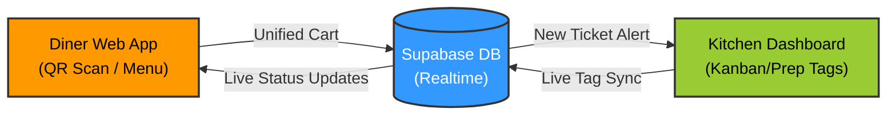

# Problems in traditional workflow

Order mix-ups and bad communication between servers and the kitchen hurt restaurant efficiency. When front-of-house and back-of-house teams cannot talk in real time, it causes long wait times, food waste, and unhappy customers.
Here are 5 big problems in restaurants, why they happen, and the bad fixes used today:

## 1. Order Entry Delays

* Root Cause: Servers write orders on paper and walk to a central computer to type them in. Lines form at the computer during busy hours.
* Bad Fix: Servers take orders from many tables before typing them all at once. This suddenly floods the kitchen with too many tickets.

## 2. Confusing Special Requests

* Root Cause: Custom orders (like "no onions") rely on memory or handwriting. Kitchen computer screens often hide these notes.
* Bad Fix: Chefs stop cooking to ask the server for clarity, or servers walk into the loud kitchen to explain the allergy.

## 3. Out-of-Stock Food Blindspot

* Root Cause: The kitchen runs out of food, but servers do not know until they try to enter the order.
* Bad Fix: The server takes a bad order, finds out it is sold out, and goes back to tell the customer to pick something else.

## 4. Bad Ticket Timing

* Root Cause: Paper kitchen tickets do not change when customers ask to delay their main food or get appetizers early.
* Bad Fix: Chefs use highlighters and memory to sort paper tickets on a metal rail.

## 5. No "Food Ready" Alerts

* Root Cause: Servers do not know food is ready until they walk to the kitchen to look.
* Bad Fix: Chefs yell out table numbers or ring physical bells. Food gets cold under heat lamps while waiting.

----

# Gap Anlaysis of Existing Solutions

Toast, Square, me&u, and Mr Yum are popular QR ordering systems. They stop manual typing errors but create new problems.
Here are the 3 major features missing and what users complain about:

## 1. Mixed Up Ticket Timing

* The Problem: Orders go straight to the kitchen the moment a guest taps "Submit."
* The Friction: If 8 people at one table order separately, the kitchen gets 8 separate tickets. The kitchen might send out some main dishes before the appetizers arrive.
* User Complaint: Kitchens get overwhelmed because they cannot group or pause orders for the same table.

## 2. Bad Allergy Formats & Slow Inventory Sync

* The Problem: Menus use rigid check-boxes that fail to show serious allergy warnings or fast inventory changes.
* The Friction: Critical allergy notes get hidden in tiny text boxes on kitchen screens. Also, if an ingredient runs out, the guest's menu does not update instantly.
* User Complaint: Chefs miss important allergy notes, leading to dangerous health risks and wrong meals.

## 3. One-Way Kitchen Screens

* The Problem: Kitchen screens only show when an order is done, not the progress in between.
* The Friction: When a cook starts making food, the status change is not sent to the server or the guest.
* User Complaint: Servers must still walk into the kitchen to ask how long food will take. Guests get anxious seeing a frozen screen.

----

# Problem Brief
Project Name: AeyChhotu!

Product Vision: A zero-download, real-time operational bridge that groups individual table requests into a single unified cart and provides two-way live status updates between diners and the kitchen.

## Strategic Objectives for the MVP

   1. Eliminate Ticket Fragmentation: Force individual smartphone carts at the same physical table to merge into one cohesive order before hitting the kitchen line.
   2. Highlight Food Safety: Make custom modifications and allergy alerts visually unavoidable on the kitchen display screen.
   3. Bridge the Communication Gap: Use Supabase Realtime to stream live preparation updates (Pending → Preparing → Ready) straight to the diner's mobile browser.

------------------------------
## 👥 Persona Matrix
To understand exactly how our MVP features provide value, we map our core software interfaces to the target users experiencing the real-time workflow.

| Attribute |  The Diner | 🍳 The Line Chef (Mr. Baawarchi) | 🏃‍♂️ The Server / Floor Manager (Chhotu) |
|---|---|---|---|
| Core Interface | Diner Mobile Web App (Accessed via QR code scan, zero download). | Digital KDS Dashboard (Wall-mounted or counter tablet grid). | Floor View / Pass Tracker (Handheld mobile view or central terminal). |
| Primary Goal | Order food accurately, customize items for safety, and track wait times without anxiety. | Receive clear, grouped tickets and update preparation status tags instantly without leaving the line. | Keep track of floor pacing, eliminate trips to the kitchen window, and manage out-of-stock items. |
| Biggest Pain Point | Ordering a meal only to find out 10 minutes later it is sold out; seeing a frozen "Order Sent" screen. | Getting flooded with 5 separate small tickets from the exact same table; missing small text allergy alerts. | Running back and forth into a loud kitchen to ask, "How much longer on the steaks for Table 4?" |
| MVP Value Metric | Time-to-Food Clarity: The number of seconds between ordering and seeing the live cooking status update. | Ticket Cleanliness: Zero split-tickets per table and zero missed high-visibility allergy modifications. | Step Reduction: Lowering the number of physical trips to the kitchen pass to check on order status. |
| Core System Action | Scans QR code, edits a shared table cart, types custom notes, and triggers the "Review & Fire" button. | Views incoming tickets, reads high-contrast red alert text, and uses one-tap status changes. | Monitors table progress tags and utilizes the quick-toggle menu availability toggle (Manual 86ing). |

------------------------------

