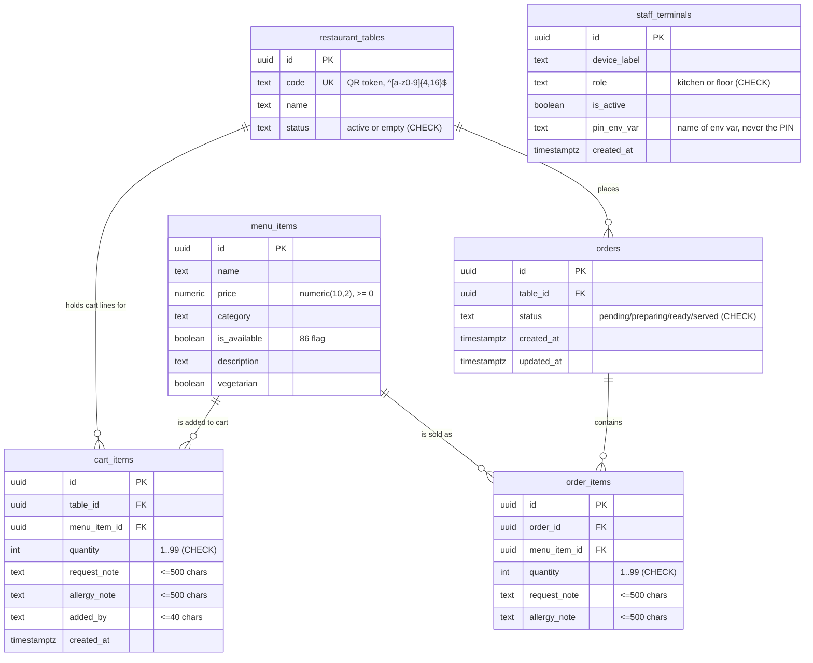

# 10 — Database Report

**Role of this doc:** a plain-English review of the schema by a Senior Database Engineer.
**Sources:** `backend/sql/001_init.sql` (schema + indexes + RLS + `fire_order()`), `backend/sql/seed.sql`,
`docs/7-api-contract.md` (E1–E17), `backend/src/services/*.ts` (the actual SQL), live DB `aeychhotu`.

**One-line verdict:** the schema is in good shape — money is `numeric`, dates are `timestamptz`, every
enum-ish field has a `CHECK`, and every endpoint is already covered by an existing index. The real gaps
are: no price snapshot on order history, hand-maintained `updated_at`, no timestamps on 3 tables, and one
"only one active order per table" rule that lives in app code instead of the database.

> **Status — fix round applied (`backend/sql/002_review_fixes.sql`, run 2026-09-28, all tests green):**
> **(1)** RLS SELECT policies are now claim-scoped — no token ⇒ 0 rows, diner token ⇒ own table only,
> staff token ⇒ whole floor (review finding 1 / Rule 14). **(2)** `orders.table_id` is now
> `ON DELETE RESTRICT` (review finding 3). **(3)** `orders_one_active_uq` enforces Rule 12 in the
> database itself. App side: E6 cart updates are atomic `quantity = quantity + delta` writes (review
> finding 2), E15 requires `table_token` (review finding 5), and list views walk every page instead of
> stopping at item 100 (review finding 4). Still open by design: §4 rows 1, 3 and 4 (price snapshots,
> audit timestamps, native enum type).

---

## 1. The database as a diagram



**How to read it:** `restaurant_tables ||--o{ orders` means *"one table has many orders"* (the `o{` side is
the "many"). `staff_terminals` sits alone — it has **no foreign key** to anything (it only supplies a
`terminal_id` claim into the JWT), which is why it has no line in the diagram.
**Delete behaviour:** `cart_items → restaurant_tables` and `orders → restaurant_tables` are `ON DELETE
CASCADE` (deleting a table takes its carts/orders with it); every `→ menu_items` link is `ON DELETE
RESTRICT` (you cannot delete a dish that is referenced by a ticket).

---

## 2. Every app rule → the database rule that protects it

| # | App rule (plain English) | Guarded by | Verdict |
|---|---|---|---|
| 1 | No two tables can share a QR code | `UNIQUE (code)` on `restaurant_tables` | ✅ done |
| 2 | Codes must look like `abc123` (4–16 lowercase chars) | `CHECK (code ~ '^[a-z0-9]{4,16}$')` | ✅ done |
| 3 | A table is either `active` or `empty` | `CHECK (status IN ('active','empty'))` | ✅ done |
| 4 | An order is `pending/preparing/ready/served` — nothing else | `CHECK (status IN (…))` on `orders` | ✅ done |
| 5 | A dish can never cost a negative amount | `CHECK (price >= 0)` + `numeric(10,2)` | ✅ done |
| 6 | Quantity is always a whole number 1–99 | `CHECK (quantity BETWEEN 1 AND 99)` on `cart_items` **and** `order_items` | ✅ done |
| 7 | Notes ≤ 500 chars, "added by" ≤ 40 chars | `CHECK (char_length(...) <= …)` on all four columns | ✅ done |
| 8 | Two taps on the same dish **merge into one cart line** instead of forking a duplicate | `UNIQUE INDEX cart_items_upsert_uq (table_id, menu_item_id, request_note, allergy_note)` — the same columns the `ON CONFLICT` in E5 targets | ✅ done |
| 9 | A cart line always belongs to a real table and a real dish | FK `table_id → restaurant_tables` (CASCADE), FK `menu_item_id → menu_items` (RESTRICT) | ✅ done |
| 10 | An order always belongs to a real table; its lines to a real order + dish | FK `orders.table_id`, FK `order_items.order_id` / `.menu_item_id` | ✅ done |
| 11 | You cannot delete a dish that already appears on a ticket (history stays readable) | FK `ON DELETE RESTRICT` on both `cart_items.menu_item_id` and `order_items.menu_item_id` | ✅ done |
| 12 | **A table can have only ONE active order at a time** (your "one slot, one confirmed booking") | `UNIQUE INDEX orders_one_active_uq (table_id) WHERE status IN ('pending','preparing','ready')` — the partial index in §below. `fire_order()` still guards first (friendly `DUPLICATE_ORDER`) behind its `FOR UPDATE` | ✅ done — enforced by the database |
| 13 | Status only moves forward: `pending → preparing → ready → served` | **No DB constraint.** E11 does a conditional `UPDATE … WHERE id = $2 AND status = $3`; E12 checks `status = 'ready'` inside a transaction | ⚠️ app-only → suggestion below |
| 14 | Nobody can edit another table's cart line | FK + every `UPDATE`/`DELETE` re-asserts `AND table_id = $2` in SQL + RLS (`anon` has SELECT-only policies) | ✅ done (3 layers) |
| 15 | The staff PIN is never stored in the database | `staff_terminals.pin_env_var` stores the **name** of the env var (`STAFF_PIN`), never its value; comparison happens in Node with `timingSafeEqual` | ✅ done |
| 16 | Only kitchen-role tokens may 86 items or move tickets | `CHECK (role IN ('kitchen','floor'))` + JWT `role` claim checked in `requireRole()` | ✅ done |

### ⚠️ Rule 12 — the important one, and your "cancelled booking" clause

**Today:** the rule is now enforced **twice**: `fire_order()` still checks first (it returns a friendly
`DUPLICATE_ORDER` 409 instead of a driver error), and `orders_one_active_uq` is the backstop for anyone
who talks to Postgres directly — a script, a second backend, a manual `INSERT`.

**The rule, as implemented in `001_init.sql` + `002_review_fixes.sql`:** a **partial unique index**:

```
UNIQUE (table_id) WHERE status IN ('pending','preparing','ready')
```

Read it as: *"a `table_id` may appear **only while its order is active**."*

**Why your "cancelled must not block re-booking" requirement is safe:** a partial index only stores rows
that match its `WHERE`. The moment an order becomes `served` (your "closed/cancelled" state) it **falls
out of the index** and stops blocking — exactly the same reason the current guard filters on
`status IN ('pending','preparing','ready')` instead of "any order exists". So:

| Order state | Blocks a new fire? |
|---|---|
| `pending` / `preparing` / `ready` | ✅ yes (correct — one active ticket) |
| `served` (closed, 86'd round, abandoned table) | ❌ no — free to fire again |

You do **not** need soft-deletes or a `cancelled_at` column for this; the partial index does it for you.

**Rule 13 suggestion (state machine):** a `CHECK` cannot see the *old* value of a row, so it can never
enforce a transition. The database-grade fix is a `BEFORE UPDATE` trigger that reads `OLD.status` and
rejects illegal jumps. Leaving it in app code is acceptable for an MVP **as long as it is written down**
(this doc now writes it down).

---

## 3. Every endpoint → columns it searches/sorts → index it needs

Rule followed: **only the index a query actually uses is listed. No extra indexes are proposed anywhere.**

| Endpoint | Searches (WHERE) | Sorts (ORDER BY) | Index that serves it |
|---|---|---|---|
| E1 `POST /sessions/initialize` | `restaurant_tables.code` (+ UPDATE by `id`) | — | `restaurant_tables_code_key` UNIQUE(code) ✅ |
| E2 `POST /auth/kds-login` | `staff_terminals.role='kitchen' AND is_active` | `created_at, id` LIMIT 1 | **None needed** — table holds 1–3 rows; a seq scan beats an index |
| E2b `GET /auth/me` | *(no query — token is decoded)* | — | — |
| E3 `GET /menu` | `category =`, `name ILIKE '%q%'` | `category, name` + LIMIT/OFFSET | `menu_items_category_idx (category)` ✅. `ILIKE '%…%'` cannot use a btree anyway, and with 20 rows a scan is fastest → **no index** |
| E4 `GET /cart/items` | `table_id` (+ `count(*)`) | `created_at, id` + LIMIT/OFFSET | `cart_items_table_created_idx (table_id, created_at, id)` ✅ exact match |
| E5 `POST /cart/items` | `menu_items.id`; `ON CONFLICT (table_id, menu_item_id, request_note, allergy_note)`; `sum(quantity) WHERE table_id AND menu_item_id` | — | PK(id) + `cart_items_upsert_uq` ✅ (the upsert index also serves the sum) |
| E6 `PATCH /cart/items/:id` | `id AND table_id` (then the same `sum`) | — | `cart_items_pkey` ✅ |
| E7 `DELETE /cart/items` | `id AND table_id` | — | `cart_items_pkey` ✅ |
| E8 `POST /orders/fire` | `restaurant_tables.code FOR UPDATE`; `orders.table_id AND status IN (…)`; `cart_items.table_id FOR UPDATE`; join `menu_items.id` | — | `restaurant_tables_code_key` ✅ · `orders_table_status_idx (table_id, status)` ✅ · `cart_items_table_created_idx` ✅ · `menu_items_pkey` ✅ |
| E9 `GET /sessions/:token/active-check` | `orders.table_id AND status IN (…)` | `created_at DESC` LIMIT 1 | `orders_table_status_idx` ✅ (the sort touches only that table's handful of rows) |
| E10 `GET /kds/tickets` | `status <> 'served'` (or `status = $1`) | `created_at, id` + LIMIT/OFFSET | `orders_active_idx (status) WHERE status <> 'served'` ✅ for the filter · `orders_created_idx (created_at DESC, id DESC)` ✅ for the order (btree scans backwards) |
| E11 `PATCH /kds/tickets/:id/status` | `id AND status` (conditional UPDATE) | — | `orders_pkey` ✅ |
| E12 `PATCH /kds/tickets/:id/prune` | `id FOR UPDATE`; `table_id AND status <> 'served'`; UPDATE `restaurant_tables.id` | — | `orders_pkey` ✅ · `orders_table_status_idx` ✅ · `restaurant_tables_pkey` ✅ |
| E13 `POST /kds/shift/activate` | *(no query — in-memory `Map`)* | — | — |
| E14 `PATCH /menu/items/:id/availability` | `menu_items.id` | — | `menu_items_pkey` ✅ |
| E15 `GET /orders/:id/status` | `orders.id` | — | `orders_pkey` ✅ |
| E16 `GET /orders?table_token=…` | `restaurant_tables.code`; `orders.table_id`; subquery `order_items.order_id` + join `menu_items.id` | `orders.created_at DESC, id DESC`; items by `oi.id` | `restaurant_tables_code_key` ✅ · `orders_table_status_idx` ✅ (leading `table_id`) · `order_items_order_idx (order_id)` ✅ · `menu_items_pkey` ✅ |
| E17 `GET /floor/tables` | subquery `orders.table_id AND status IN (…)`; subquery `cart_items.table_id` | `restaurant_tables.code`; `orders.created_at DESC` LIMIT 1 | `restaurant_tables_code_key` UNIQUE(code) ✅ (also serves `ORDER BY code`) · `orders_table_status_idx` ✅ · `cart_items_table_created_idx` / `cart_items_upsert_uq` ✅ (both lead with `table_id`) |

**Conclusion: 0 new indexes.** Every access path is already covered by a PK, a UNIQUE, or one of the 7
indexes declared in `001_init.sql`. (The later fix round added `orders_one_active_uq` — that one is a
*constraint* enforcing Rule 12, not an access path, so it is not counted here.) Borderline spots (E9, E16 sort a few rows *after* filtering by
`table_id`) were deliberately left alone — adding an index there would violate "no extra index" and buy
nothing at this data volume. (Note: at today's row counts `EXPLAIN` shows sequential scans everywhere —
that is *correct* behaviour, not a missing index; the table above is about which index each query would
use as data grows.)

---

## 4. Data-type & hygiene audit

| Problem | Why it matters | Fix |
|---|---|---|
| **Money leaks into float on the way out** — the column is the correct `numeric(10,2)`, but E3 selects `price::float8 AS price`, so a binary float is what leaves the database; and there is **no price snapshot anywhere on a ticket** (`order_items` has no price, `orders` has no total) | `numeric` is exact (`0.1 + 0.2` is right); float is approximate. Worse: because tickets store no price, if a dish is re-priced after firing, an **old ticket's bill silently changes** — the kitchen/history shows money that was never charged | Keep `numeric(10,2)`; stop casting to `float8` in the query (serialize the `numeric` as-is); add `order_items.unit_price numeric(10,2)` filled by `fire_order()` and an `orders.total numeric(10,2)` so a bill is frozen at the moment it was fired |
| **Dates stored as text** — ✅ **not found**: every timestamp column is `timestamptz` (`created_at`/`updated_at`), and the API serialises them as ISO-8601 UTC strings, which is the correct wire format | Text dates break sorting (`"10/09"` vs `"9/09"`), break time zones, and break `interval` maths | Nothing to fix. Keep writing `timestamptz` and never let a future migration introduce a `text`/`varchar` date column |
| **Missing `createdAt`/`updatedAt`** — `menu_items`, `restaurant_tables`, `order_items` have **neither**; `cart_items` has `created_at` but no `updated_at` (E6 edits quantity/notes untracked); `orders.updated_at` exists but is written **by hand** in E11/E12 instead of by the database | You can't answer "when was this dish 86'd?", "who changed this line and when?", or "did anything touch this order?". A future `UPDATE` that forgets `updated_at = now()` leaves a silently wrong audit field | Add `created_at timestamptz NOT NULL DEFAULT now()` + `updated_at` to `menu_items`, `cart_items` (already has `created_at`), `restaurant_tables`, `order_items`; then one shared `BEFORE UPDATE … SET updated_at = now()` trigger (the `moddatetime` extension) so no query can ever forget it |
| **Status stored as free text** — `orders.status`, `restaurant_tables.status`, `staff_terminals.role` are `text` columns | Plain text allows typos (`'pendng'`) that then match no `WHERE` clause and vanish from every screen | Already mitigated: each column carries a `CHECK (status IN (…))`, which behaves exactly like an enum for inserts/updates. Optional hardening later: convert to a native Postgres `ENUM` type (stricter — even `ALTER TABLE` can't slip a value past it) and add the Rule-13 transition trigger. **No action needed for the MVP** |
| **Password/PIN hash in responses** — ✅ **not found (verified)**: there is no users/password table at all; the PIN lives only in the `STAFF_PIN` env var, `staff_terminals.pin_env_var` stores the *variable name*, E2 returns only a signed token, and E2b returns only decoded claims | Sending a hash still hands an attacker something crackable offline; the usual bug is `SELECT *` on a `users` table leaking `password_hash` | Nothing to fix. Two things to watch: (a) never add `SELECT *` against `staff_terminals`; (b) the single shared PIN means **no per-staff identity** — if you later need "who pruned this ticket", add a `staff_users` table with a *hashed* PIN (bcrypt/argon2) and stamp `performed_by` on `orders`, instead of echoing anything back |
| **`orders → restaurant_tables` is `ON DELETE CASCADE`** — deleting a table row erases all of its order history | A mistaken `DELETE FROM restaurant_tables` (or a future "remove table" feature) silently destroys tickets, prices and audit trail | If history matters: ✅ **applied** — `002_review_fixes.sql` switched the FK to `ON DELETE RESTRICT` (verified: deleting a table row now raises a foreign-key violation). When a "remove table" feature lands, soft-delete (`deleted_at timestamptz`) instead of removing rows |

**Not a problem, checked on purpose:** `quantity` is an `integer` (never float) ✅ · no `money` type
(Postgres' `money` is locale-dependent — `numeric` is the right call) ✅ · RLS blocks anon writes on every
table ✅ · the `fire_order()` function is revoked from `PUBLIC`/`anon` so a browser cannot fire tickets
directly ✅.
