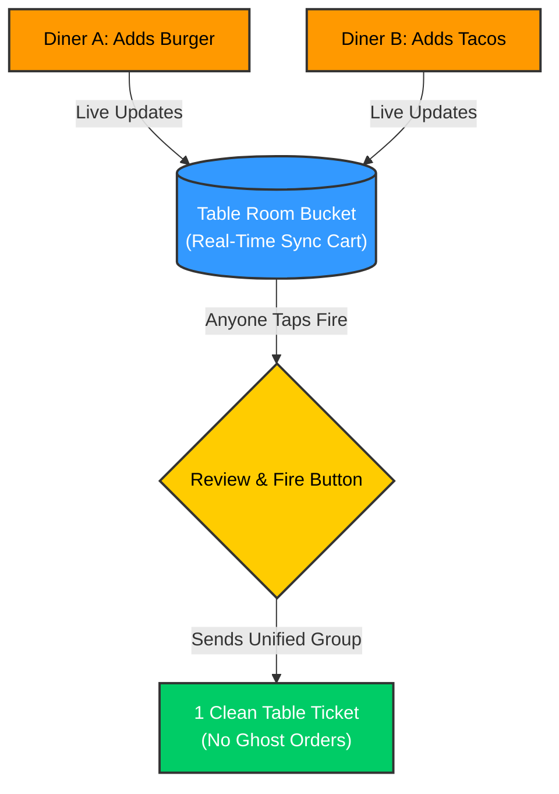
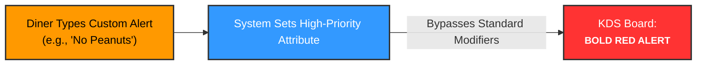
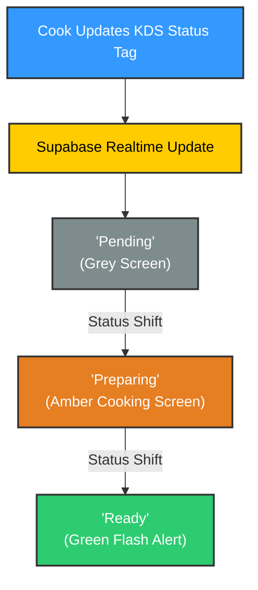

## The MVP Value Proposition

For busy, fast-casual restaurants overwhelmed by disjointed QR orders, our platform is a lightweight web workflow that unifies table orders before they hit the kitchen and synchronizes prep milestones in real time. Unlike Toast or Square, we protect kitchen pacing and keep diners informed without complex hardware or app downloads.

----

To build a working prototype in 4 days using a simple tech stack (Next.js and Supabase), the features are split into immediate implementation and future scope.

## Core Features (To Be Implemented Now)

## Core Features (To Be Implemented Now)

* QR-Table Link: Each table's QR code opens a random link like /table/k7x2p (not /table/5, which anyone could guess). It opens the menu and assigns the table instantly without a login.
* Shared Table Cart: One shared digital cart for the entire table so individual orders stay grouped together. Every phone at the table sees changes live through Supabase Realtime.
* "Review & Fire" Button: A final button to submit the entire table's order to the kitchen at one time. Before sending, it checks that no item has sold out. After sending, the cart empties, so a second tap shows "Order already sent" and the table can start a new round.
* Kitchen Kanban Board: A real-time screen for cooks with Pending, Preparing and Ready columns. Each order appears as a card in its column.
* One-Tap Status Updates: Kitchen staff tap a single button to change order tags from Pending ➔ Preparing ➔ Ready ➔ Served. Served removes the order from the board.
* Live Guest Tracker: A simple, self-updating screen for diners showing the current state of their food.
* Red Allergy Text: Allergies go in a separate "Allergy" box (saved as allergy_note). Only these render in bold red on the kitchen screen; normal requests like "extra sauce" stay in normal text.
* Screen Flash & Sounds: The diner's screen flashes green when food is ready, and the kitchen tablet pings when new orders arrive. Browsers block sound until the page is tapped, so the kitchen taps "Start shift" once when opening the board.
* Quick Item Hide (86ing): A fast button for the chef to mark a dish out-of-stock and grey it out on the guest menu.
* Staff PIN: The kitchen board opens only after entering a shared staff PIN (stored as the STAFF_PIN environment variable), so diners cannot open it.

## Future Scope (Post-MVP)

* Wait Time Guesses: Showing an estimated cooking time based on how busy the kitchen screen is.
* Call Server Button: A digital buzzer for guests to summon a waiter to their table.
* In-App Payments: Adding Stripe or Apple Pay tools so guests can pay directly from the web app.
* Smart Course Splitting: Automated code to separate and time appetizers from main courses on the kitchen screen.
* Profiles & Accounts: Saving user accounts, login history, and favorite food items for repeat diners.

--------------

## Innovative space

This solution brings three core innovations to the restaurant tech space:

### 1. The "Anti-Chaos" Unified Cart

* The Innovation: Instead of treating every individual smartphone scan as an independent customer, your system creates a single, live-syncing room bucket for the entire table.
* The Impact: It acts as a digital gatekeeper. It stops the kitchen from getting flooded with 8 separate tickets for one table, protecting course timing without requiring a server to manually combine orders.

### 2. Guardrailed Allergy Alerts

* The Innovation: Custom modifications and dietary notes bypass standard small-text logs. They are formatted automatically to display in bold, high-contrast red directly on the main KDS ticket line.
* The Impact: It removes human error caused by bad handwriting or forgotten verbal warnings. Chefs instantly see safety risks without stopping the cooking line.
  

### 3. Two-Way Micro-Status Communication

* The Innovation: Your KDS transitions away from a static "Done/Not Done" checkbox. It broadcasts exact preparation milestones (Pending ➔ Preparing ➔ Ready) through Supabase Realtime to the guest's mobile browser and the waitstaff's devices.
* The Impact: It bridges the communication gap between the floor and the kitchen. Guests lose their waiting anxiety, and servers never have to run back to the kitchen window to check on an order.
  

------------------------------

## What we are actively ignoring
* No Payments: Diners will pay the waiter at the end via the house traditional POS. We are managing operations, not transactions right now.
* No Authentication: No "Sign up with Google" or phone number verification. If they are sitting at Table 5, their physical location is their authorization token.

----------------------

## Database Tables (Supabase)

| Table | Fields |
|---|---|
| restaurant_tables | id, code (random, used in the QR link), name |
| menu_items | id, name, price, category, is_available |
| cart_items | id, table_id, menu_item_id, quantity, request_note, allergy_note |
| orders | id, table_id, status (pending, preparing, ready, served), created_at |
| order_items | id, order_id, menu_item_id, quantity, request_note, allergy_note |

For the MVP, menu items and tables are added directly in the Supabase dashboard.

