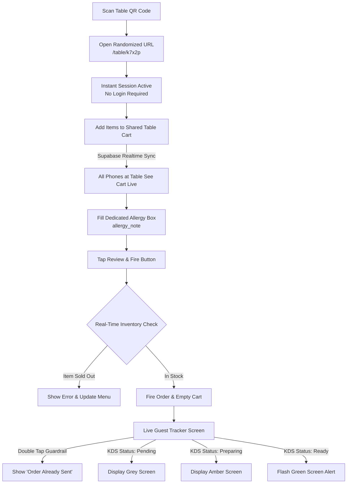
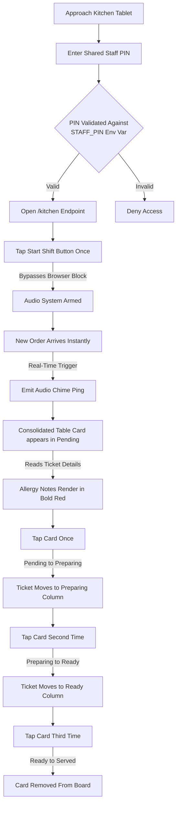
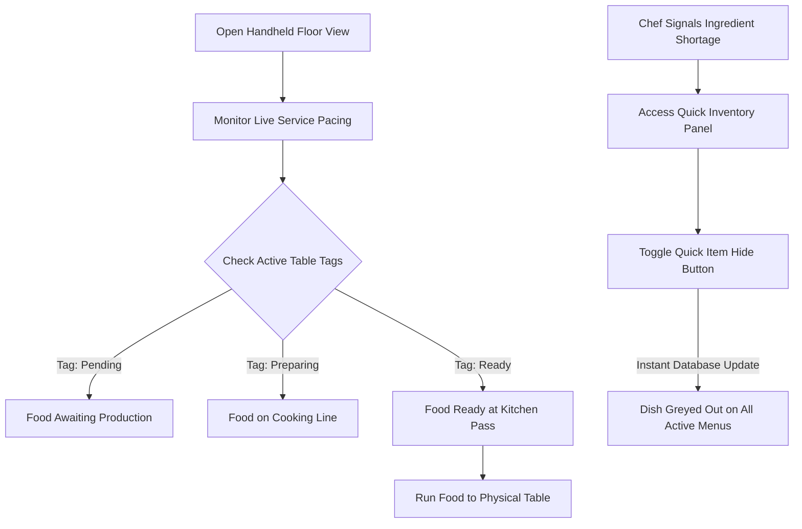

1. Diner Workflow

```mermaid
graph TD
    A[Scan Table QR Code] --> B[Open Randomized URL<br>/table/k7x2p]
    B --> C[Instant Session Active<br>No Login Required]
    C --> D[Add Items to Shared Table Cart]
    D -->|Supabase Realtime Sync| E[All Phones at Table See Cart Live]
    E --> F[Fill Dedicated Allergy Box<br>allergy_note]
    F --> G[Tap Review & Fire Button]
    G --> H{Real-Time Inventory Check}
    H -->|Item Sold Out| I[Show Error & Update Menu]
    H -->|In Stock| J[Fire Order & Empty Cart]
    J --> K[Live Guest Tracker Screen]
    K -->|Double Tap Guardrail| L[Show 'Order Already Sent']
    K -->|KDS Status: Pending| M[Display Grey Screen]
    K -->|KDS Status: Preparing| N[Display Amber Screen]
    K -->|KDS Status: Ready| O[Flash Green Screen Alert]
```

2. Chef (Mr. Baawarchi) Workflow

```mermaid
graph TD
    A[Approach Kitchen Tablet] --> B[Enter Shared Staff PIN]
    B --> C{PIN Validated Against<br>STAFF_PIN Env Var}
    C -->|Valid| D[Open /kitchen Endpoint]
    C -->|Invalid| E[Deny Access]
    D --> F[Tap Start Shift Button Once]
    F -->|Bypasses Browser Block| G[Audio System Armed]
    G --> H[New Order Arrives Instantly]
    H -->|Real-Time Trigger| I[Emit Audio Chime Ping]
    I --> J[Consolidated Table Card appears in Pending]
    J -->|Reads Ticket Details| K[Allergy Notes Render in Bold Red]
    K --> L[Tap Card Once]
    L -->|Pending to Preparing| M[Ticket Moves to Preparing Column]
    M --> N[Tap Card Second Time]
    N -->|Preparing to Ready| O[Ticket Moves to Ready Column]
    O --> P[Tap Card Third Time]
    P -->|Ready to Served| Q[Card Removed From Board]
```

3. Server (Chhotu) Workflow

```mermaid
graph TD
    A[Open Handheld Floor View] --> B[Monitor Live Service Pacing]
    B --> C{Check Active Table Tags}
    C -->|Tag: Pending| D[Food Awaiting Production]
    C -->|Tag: Preparing| E[Food on Cooking Line]
    C -->|Tag: Ready| F[Food Ready at Kitchen Pass]
    F --> G[Run Food to Physical Table]
    H[Chef Signals Ingredient Shortage] --> I[Access Quick Inventory Panel]
    I --> J[Toggle Quick Item Hide Button]
    J -->|Instant Database Update| K[Dish Greyed Out on All Active Menus]

```
